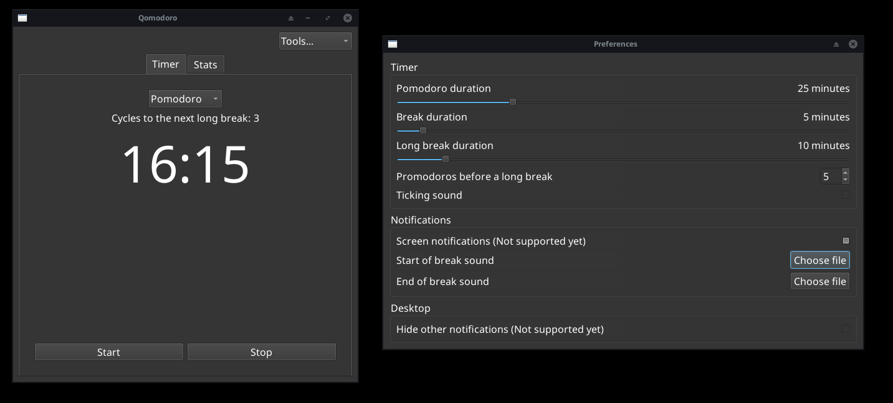
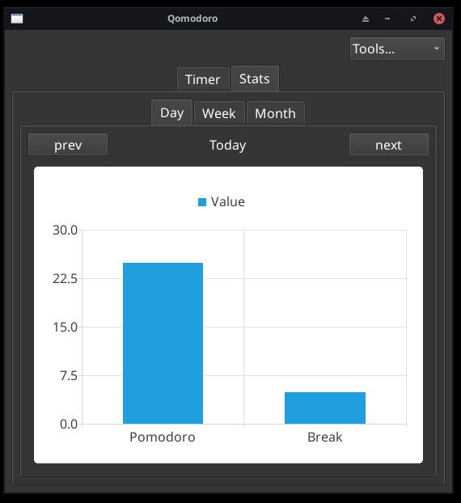

# Qomodoro

A cross‑platform, Qt‑based clone of gnome-Pomodoro.

## Why?

gnome-Pomodoro is tightly coupled to GTK and the GNOME shell. I created this because this is way more lightweight.

## Screenshots

### Timer + Config

### Stats

---

## Features

* Configurable work and break durations (default 25 / 5)
* Short and long breaks with automatic cycling
* Pause, skip, or reset the current timer
* Progress chart, shows daily completed Pomodoros

---

**Prerequisite packages**:

```bash
# Fedora
sudo dnf install cmake make qt6-qtbase-devel qt6-qttools-devel qt6-qtcharts-devel qt6-qtmultimedia-devel
# Ubuntu
sudo apt install cmake make qt6-base-dev qt6-base-dev-tools libqt6charts6-dev qt6-multimedia-dev
```

## Building

```bash
./run.sh
```
